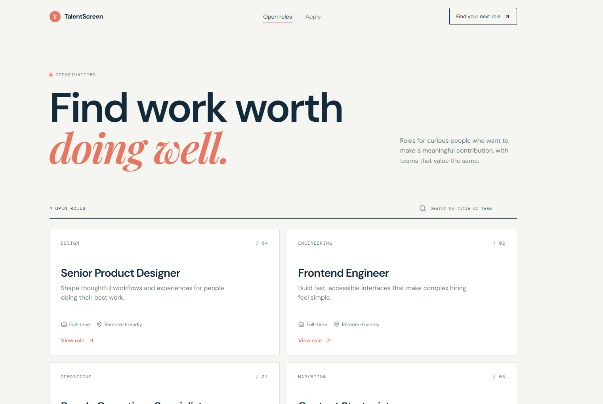
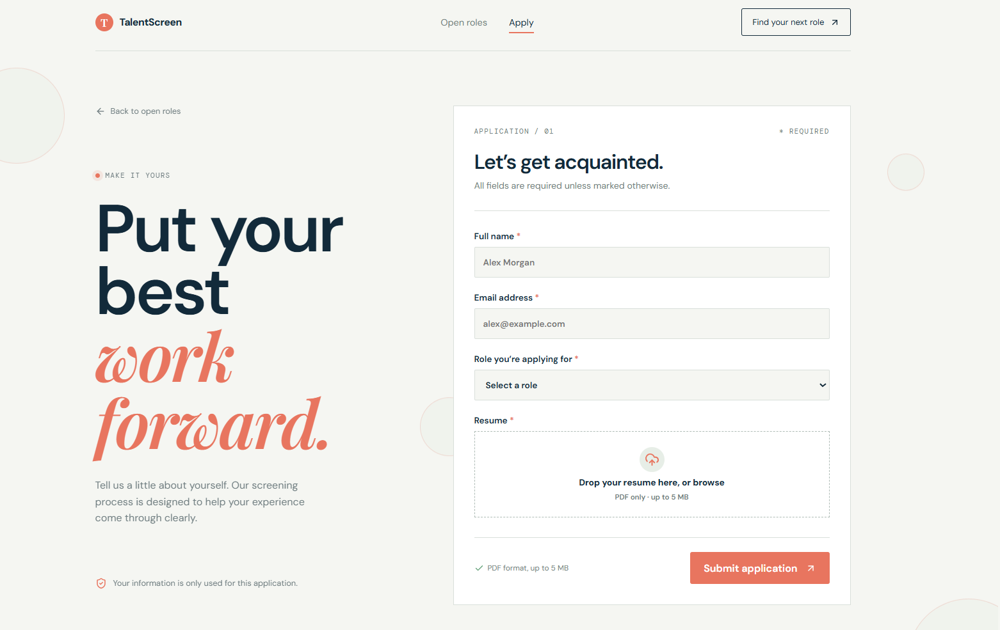
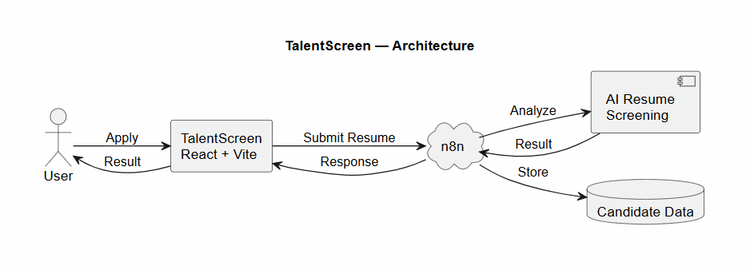

# TalentScreen

TalentScreen is a responsive recruitment platform that streamlines candidate applications and AI-powered resume screening through an automated n8n workflow.



## Features

- Responsive home, jobs, and application routes
- Job search with role-specific application links
- Accessible application form with inline validation
- Drag-and-drop PDF upload with MIME, extension, and 5 MB validation
- Real multipart form submission to an n8n webhook
- Honest uploading, processing, success, and error states
- 90-second request timeout for AI processing and email delivery
- Environment-based webhook configuration
- Vercel-ready client-side deployment

## Screenshots

### Home

The landing page introduces the application flow and directs candidates to open roles.


### Application

The application route collects candidate details and accepts a PDF resume.



## Architecture



The frontend sends these exact multipart fields to the n8n webhook:

- `name` - candidate full name
- `email` - candidate email address
- `role` - selected job title
- `data` - uploaded PDF resume file

A successful HTTP response confirms that the application was submitted to the workflow. The frontend does not fabricate or assume an ATS score. The screening workflow processes the application and delivers the result to the candidate by email.

## Tech Stack

- React 19
- TypeScript
- Vite
- React Router
- Lucide React
- Oxlint
- n8n webhook integration

## Local Development

### Requirements

- Node.js 18 or newer
- npm

### Install

```bash
npm install
```

### Configure the webhook

Create a `.env.local` file in the project root:

```env
VITE_N8N_WEBHOOK_URL=https://your-n8n-instance/webhook/your-webhook-id
```

`.env.local` is ignored by Git. Use `.env.example` as the configuration reference.

### Start the development server

```bash
npm run dev
```

Open the local URL shown by Vite, usually `http://localhost:5173`.

### Validate the project

```bash
npm run lint
npm run build
```

## Routes

- `/` - Home page
- `/jobs` - Open roles and search
- `/apply` - General application form
- `/apply/:jobId` - Application form with a role preselected

## Project Structure

```text
src/
  components/    Shared interface components
  data/          Open role data
  lib/           Webhook integration
  pages/         Routed page components
public/assets/   README screenshots and architecture diagram
```
